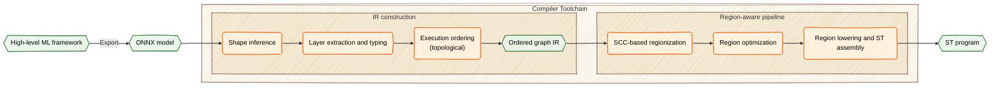

# Compilation pipeline

```mermaid
%%{init: {'look': 'handDrawn', 'theme': 'default'}}%%
flowchart LR
    %% --- Styling ---
    classDef rep shape:hexagon,fill:#e8f5e8,stroke:#1b5e20,stroke-width:1px,color:black
    classDef action shape:rounded,fill:#fff3e0,stroke:#e65100,stroke-width:1px,color:black

    %% --- Nodes ---
    Source{{High-level ML framework}}:::rep
    Input{{ONNX model}}:::rep
    OrderedIR{{Ordered graph IR}}:::rep
    Output{{ST program}}:::rep

    Shape("Shape inference"):::action
    BuildIR("Layer extraction and typing"):::action
    Order("Execution ordering\n(topological)"):::action
    Regionize("SCC-based regionization"):::action
    Optimize("Region optimization"):::action
    Lower("Region lowering and ST assembly"):::action

    %% --- Connections ---
    Source -->|Export| Input
    Input --> Shape

    subgraph Toolchain ["Compiler Toolchain"]
        direction LR
        subgraph IRBuildGroup ["IR construction"]
            direction LR
            Shape --> BuildIR --> Order --> OrderedIR
        end

        subgraph RegionFlowGroup ["Region-aware pipeline"]
            direction LR
            OrderedIR --> Regionize --> Optimize --> Lower
        end
    end

    style Toolchain fill:#f7f1e3,stroke:#8d6e63,stroke-width:1px
    style IRBuildGroup fill:#f1e3c8,stroke:#8d6e63,stroke-width:1px
    style RegionFlowGroup fill:#f1e3c8,stroke:#8d6e63,stroke-width:1px

    Lower --> Output
```
