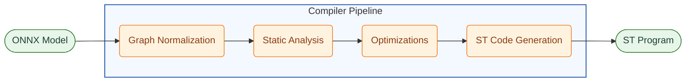

```mermaid
%%{init: {'theme': 'default'}}%%
flowchart LR

    %% --- Styling ---
    classDef rep fill:#e8f5e9,stroke:#2e7d32,stroke-width:1px,color:#1b4332
    classDef stage fill:#eaf2ff,stroke:#2a5db0,stroke-width:1.5px,color:#1a237e
    classDef action fill:#fff3e0,stroke:#ef6c00,stroke-width:1px,color:#8a3b12

    %% --- Nodes ---
    Input([ONNX Model]):::rep
    Output([ST Program]):::rep

    %% --- Stages ---
    Norm("Graph Normalization"):::action
    Analysis("Static Analysis"):::action
    Opt("Optimizations"):::action
    Codegen("ST Code Generation"):::action

    %% --- Pipeline ---
    Input --> Norm --> Analysis --> Opt --> Codegen --> Output

    %% --- Grouping ---
    subgraph Toolchain ["Compiler Pipeline"]
        direction LR
        Norm
        Analysis
        Opt
        Codegen
    end

    style Toolchain fill:#f4f8ff,stroke:#2a5db0,stroke-width:1.5px
```
