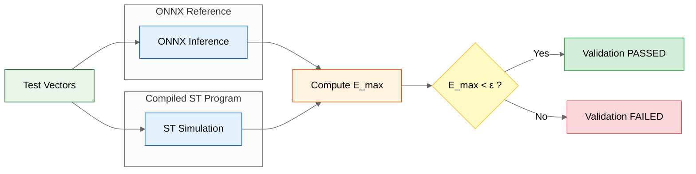

```mermaid
%%{init: {'theme': 'neutral'}}%%
flowchart LR

    %% --- Styling ---
    classDef data fill:#e8f5e8,stroke:#1b5e20,stroke-width:1px,color:black
    classDef process fill:#e3f2fd,stroke:#1565c0,stroke-width:1px,color:black
    classDef compute fill:#fff3e0,stroke:#e65100,stroke-width:1px,color:black
    classDef decision fill:#fff9c4,stroke:#fbc02d,stroke-width:1px,color:black
    classDef pass fill:#d4edda,stroke:#28a745,stroke-width:1px,color:black
    classDef fail fill:#f8d7da,stroke:#dc3545,stroke-width:1px,color:black

    %% --- Inputs ---
    X[Test Vectors]:::data

    %% --- Reference Path ---
    subgraph Ref ["ONNX Reference"]
        ONNX[ONNX Inference]:::process
    end

    %% --- Compiled Path ---
    subgraph Comp ["Compiled ST Program"]
        ST[ST Simulation]:::process
    end

    %% --- Comparison ---
    Diff[Compute E_max]:::compute
    Check{E_max < ε ?}:::decision

    Pass[Validation PASSED]:::pass
    Fail[Validation FAILED]:::fail

    %% --- Connections ---
    X --> ONNX
    X --> ST

    ONNX --> Diff
    ST --> Diff

    Diff --> Check
    Check -->|Yes| Pass
    Check -->|No| Fail
```
